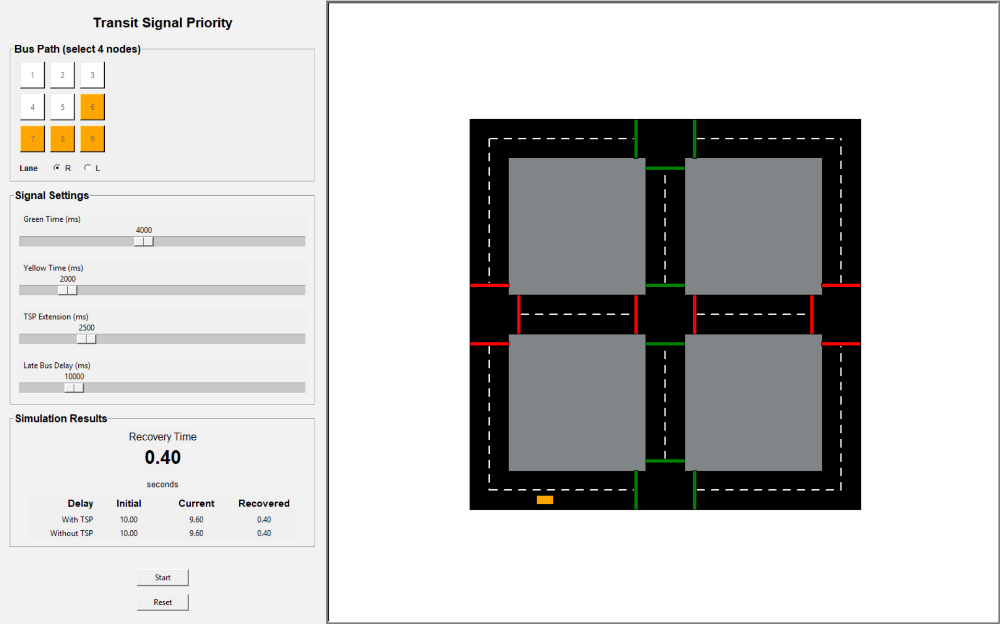
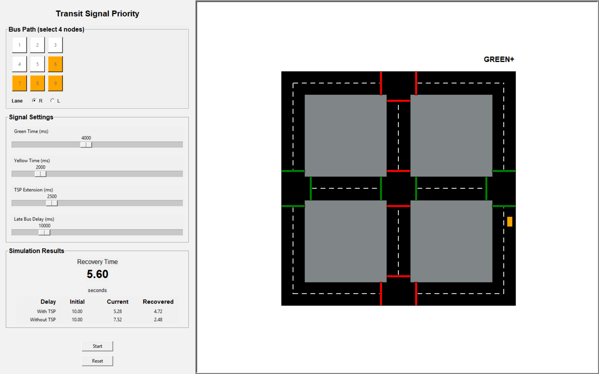
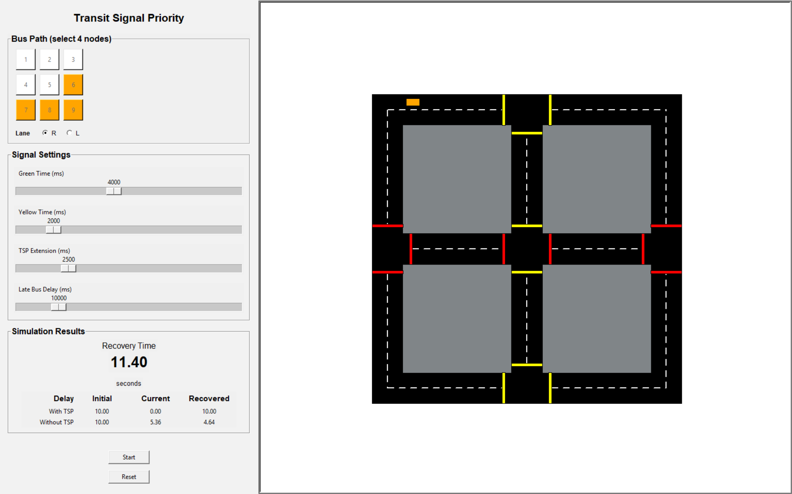

# Transit Signal Priority Simulation

A Python simulation demonstrating Transit Signal Priority (TSP) using conditional green light extension. The 
project visualizes how a delayed bus can recover schedule delay by extending green lights at signalized
intersections, and directly compares its performance to a delayed bus without TSP.

## Project Motivation

This project was inspired by a Transportation Talk hosted by the UWaterloo Institute of Transportation Engineers 
(ITE) and presented by Joanna Kervin. The presentation discussed the increasing use of 
technology in transit projects and the importance of software skills for civil engineers.

One example mentioned was the use of Transit Signal Priority on the Eglinton Crosstown LRT. This was my 
first exposure to the concept of TSP, which motivated me to build a simulation to better understand:

- how conditional signal logic works
- how priority affects bus delay recovery

## Simulation Overview
When the program runs:
1. The GUI panel opens
2. The map is drawn on screen
3. Three buses are tracked
   * Orange bus - the late bus with TSP (the only visible bus on screen)
   * Late shadow - a virtual late bus without TSP; used for comparison
   * Baseline shadow - a virtual on-schedule bus; used as the reference

The orange bus begins moving once its delay timer counts down to zero. The shadow buses are simulated
internally and are not drawn on screen.

The simulation continually tracks delay for both the late bus (with TSP) and the late shadow (without TSP),
allowing the effect of signal priority to be measured directly.

Once the late bus's current delay reaches zero, all delay timers freeze. It is assumed the bus remains on
schedule from that point on.

## Delay Calculation

At startup, the simulation calculates the distance the baseline bus would cover during the initial delay period.
When the late bus begins moving, both it and the late shadow share the same starting delay.

Each tick, the simulation checks whether the signal being approached by the late bus would have been red
for each shadow bus. That is, what colour the signal would show without any TSP extension. If the signal
would have been red, that shadow's distance counter is paused. Otherwise, it advances at the normal bus
speed.

The delay for each bus is taken as the gap between the distance covered by the baseline shadow and
the distance covered by that bus.

## Example Simulation

<table>
<tr>
<td align="center">



*Late bus starting with delay.*

</td>

<td align="center">



*Late bus requests priority and extends the green phase.*

</td>

<td align="center">



*Late bus catches up and the recovery time is displayed.*

</td>
</tr>
</table>

## How it Works
## 1. Traffic Signal Controller

The intersection is controlled by a two-phase signal controller.

### 1.1 Phases

NS (North–South) – northbound and southbound approaches

EW (East–West) – eastbound and westbound approaches

### 1.2 Signal States

The signal cycles through two states:

GREEN → YELLOW → phase swap

During GREEN:

- The active phase is green
- The opposing phase is red

During YELLOW:

- The active phase turns yellow
- The opposing phase remains red
- The controller prepares to swap phases

## 2. Transit Signal Priority Logic

Priority is triggered when the delayed bus:

1. Is late
2. Is approaching a stopline
3. Is within the extension distance

The bus sends a priority request to the signal controller.

The signal will only extend green if:

1. the signal is already green
2. the current phase has not already been extended

This prevents repeated extensions within the same signal phase.

## 3. Bus Behaviour

For each path segment, the bus:

1. Determines which stopline it is approaching
2. Reads the signal colour
3. Adjusts its speed based on distance to the stopline

### 3.1 Pathfinding
The map contains a 3×3 grid of nodes representing the road network. The user selects a path of 4 adjacent
nodes to define the outbound path. The simulation automatically closes this into a loop by finding the
shortest return path along ring road.

The ring road consists of the 8 outer nodes.

```
1 - 2 - 3
|       |
4       6
|       |
7 - 8 - 9
```

To determine return leg, the program:

1. Identifies the first and last ring road nodes in the user's path
2. Examines each consecutive pair of ring nodes in the path (including the first-to-last wrap) and "votes"
   on whether the path between them is shorter going clockwise or counter-clockwise
3. The majority vote determines the overall travel direction
4. The return leg is built by stepping from the last ring node towards the first ring node in the inferred direction, following the ring

For example, given a user path of 7 → 8 → 9 → 6, the voting step checks each consecutive ring node pair:

Pair       | i1 (ring idx) | i2 (ring idx) | CW steps | CCW steps | Vote
-----------|---------------|---------------|----------|-----------|-----
7 → 8      | 6             | 5             | 7        | 1         | CCW
8 → 9      | 5             | 4             | 7        | 1         | CCW
9 → 6      | 4             | 3             | 7        | 1         | CCW
6 → 7 wrap | 3             | 6             | 3        | 5         | CW

Three CCW votes to one CW, so the return leg steps counter-clockwise from 6 back to 7: 6 → 3 → 2 → 1 → 4 → 7, truncated once node 7 is reached. 

The full loop becomes 7 → 8 → 9 → 6 → 3 → 2 → 1 → 4 → repeat.

### 3.2 Speed adjustment

1. Go Zone 
    * Bus travels at normal speed
2. Slow Zone 
   * Bus slows if the signal is red or yellow
3. Stop Zone
   * Bus stops if the signal is red or yellow
   
### 3.3 Stopline detection
One challenge in the simulation was ensuring the bus only reacts to the correct stopline.

Initially, the bus would sometimes stop inside the intersection because it reacted to stoplines on the exit 
side of the intersection.

This was solved by filtering stoplines using geometric distance calculations:

1. the bus determines which stoplines lie along its current path segment
2. stoplines on other approaches are filtered out
3. only the stopline on intersection entry is considered

## GUI

The control panel on the left side of the screen allows the user to configure the simulation before starting:

1. Bus Path 
   * Select 4 adjacent nodes from the 3×3 grid to define the route; paths must start from a corner
     node (1, 3, 7, or 9)
   * Selected nodes are highlighted in orange and all buttons disable once 4 nodes are chosen
2. Lane
    * Choose which lane the bus travels in (R or L)
3. Signal Timing
    * Green Time - duration of the green phase (ms)
    * Yellow Time - duration of the yellow phase (ms)
    * TSP Extension - duration of the green extension granted by TSP (ms)
4. Late Bus Delay
    * The initial delay of the late bus at the start of the simulation (ms)

## Technologies Used

- Python
- Turtle Graphics
- Tkinter

## Possible Future Improvements

- comparing different types of TSP
- adding additional vehicles and traffic flows
- extending to larger or custom road networks

## Running the Simulation

Requirements:
- Python 3.x

From the project directory, run:
- python main.py

A window will open showing the GUI panel and animated simulation.